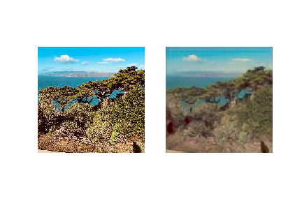

#### A fun GAN exploration!

- GAN implementation using Tensorflow / Keras, based on CycleGAN architecture, designed to transform photos into animation-style images
- Landscape photos were collected from flickr, animated photos were collected using python, scenedetect and Studio Ghibli trailers / compilation videos found on YouTube

**Results:**

- After around 75 epochs of training, losses converged to an equilibrium of around:

```
d1[0.002,0.028] d2[0.073,0.035] g[2.486,3.182]
```

- (Discriminator 1, 2, and generator losses, respectively.)

- A GIF of intermediate training results:

  

**After ~75 epochs:**



