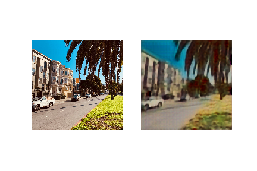
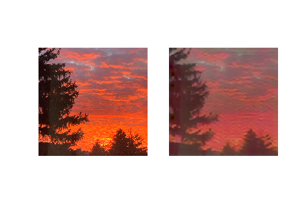

#### A fun GAN exploration!

- GAN implementation using Tensorflow / Keras, based on CycleGAN architecture, designed to transform landscape photos into animations
- Landscape photos were collected from flickr, animated photos were collected using python, scenedetect and Studio Ghibli trailers / compilation videos found on YouTube

**Results:**

**After ~20 epochs:**

**After ~65 epochs:**

